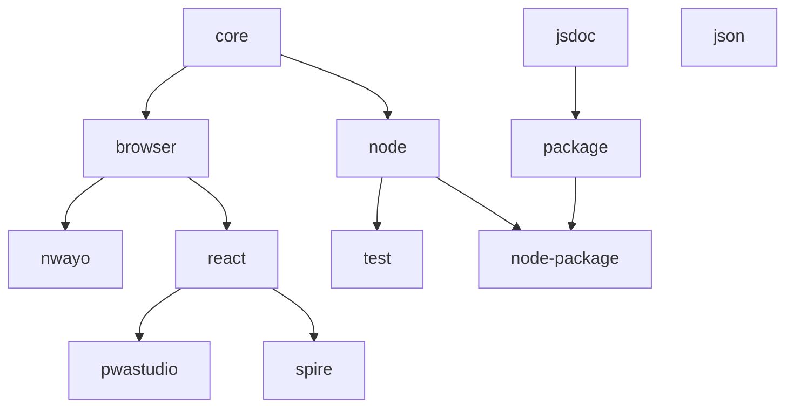

# ESLint config
[![Tests][tests-badge]][tests-url]
[![Lerna][lerna-badge]][lerna-url]

> Opinionated ESLint [shareable configs](https://eslint.org/docs/developer-guide/shareable-configs.html).


## Rulesets

| Package | Version | Description | Documentation |
|---|---|---|---|
| **[@absolunet/eslint-config-core](packages/core)** | [](https://www.npmjs.com/package/@absolunet/eslint-config-core) | **Core rules** | [docs](https://documentation.absolunet.com/eslint-config/core) |
| [@absolunet/eslint-config-node](packages/node) | [](https://www.npmjs.com/package/@absolunet/eslint-config-node) | Node.js rules | [docs](https://documentation.absolunet.com/eslint-config/node) |
| [@absolunet/eslint-config-test](packages/test) | [](https://www.npmjs.com/package/@absolunet/eslint-config-test) | Testing rules | [docs](https://documentation.absolunet.com/eslint-config/test) |
| [@absolunet/eslint-config-browser](packages/browser) | [](https://www.npmjs.com/package/@absolunet/eslint-config-browser) | Browser rules | [docs](https://documentation.absolunet.com/eslint-config/browser) |
| [@absolunet/eslint-config-nwayo](packages/nwayo) | [](https://www.npmjs.com/package/@absolunet/eslint-config-nwayo) | [nwayo](https://documentation.absolunet.com/nwayo/) rules | [docs](https://documentation.absolunet.com/eslint-config/nwayo) |
| [@absolunet/eslint-config-react](packages/react) | [](https://www.npmjs.com/package/@absolunet/eslint-config-react) | React rules | [docs](https://documentation.absolunet.com/eslint-config/react) |
| [@absolunet/eslint-config-jsdoc](packages/jsdoc) | [](https://www.npmjs.com/package/@absolunet/eslint-config-jsdoc) | JSDoc rules | [docs](https://documentation.absolunet.com/eslint-config/jsdoc) |
| [@absolunet/eslint-config-package](packages/package) | [](https://www.npmjs.com/package/@absolunet/eslint-config-package) | Package rules | [docs](https://documentation.absolunet.com/eslint-config/package) |
| [@absolunet/eslint-config-node-package](packages/node-package) | [](https://www.npmjs.com/package/@absolunet/eslint-config-node-package) | Node.js package rules | [docs](https://documentation.absolunet.com/eslint-config/node-package) |
| [@absolunet/eslint-config-json](packages/json) | [](https://www.npmjs.com/package/@absolunet/eslint-config-json) | JSON rules | [docs](https://documentation.absolunet.com/eslint-config/json) |
|-|-|-|-|
| [@absolunet/eslint-loader](packages/loader) | [](https://www.npmjs.com/package/@absolunet/eslint-loader) | Config loader | [docs](https://documentation.absolunet.com/eslint-config/loader) |


### Dependency tree



## Install

```
$ npm install @absolunet/eslint-config-[RULESET]
```


## Usage

Add some ESLint config to your `.eslintrc.yaml`:

```yaml
extends: '@absolunet/[RULESET]'
```


## Used plugins

- [eslint-plugin-unicorn](https://github.com/sindresorhus/eslint-plugin-unicorn) - Various awesome rules


## Used configuration

- [eslint-config-prettier](https://github.com/prettier/eslint-config-prettier) - Turns off all rules that are unnecessary or might conflict with Prettier.


## Related

- [prettier-config](https://github.com/absolunet/prettier-config) - Opinionated Prettier shareable configs which are used with these ESLint configurations.


## Documentation

See the [full documentation](https://documentation.absolunet.com/eslint-config) for an in-depth look.

See the [Changelog](CHANGELOG.md) to see what has changed.


## Contribute

See the [Contributing Guidelines](CONTRIBUTING.md) for ways to get started.

See the [Support Guide](SUPPORT.md) for ways to get help.

See the [Security Policy](SECURITY.md) for sharing vulnerability reports.

This project has a [Code of Conduct](CODE_OF_CONDUCT.md).
By interacting with this repository, organization, or community you agree to abide by its terms.


## License

[MIT](LICENSE) © [Absolunet](https://absolunet.com)


[tests-badge]: https://github.com/absolunet/eslint-config/workflows/tests/badge.svg?branch=production
[lerna-badge]: https://img.shields.io/badge/maintained%20with-lerna-cc00ff.svg

[tests-url]: https://github.com/absolunet/eslint-config/actions?query=workflow%3Atests+branch%3Aproduction
[lerna-url]: https://lernajs.io/
